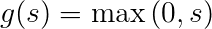
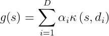
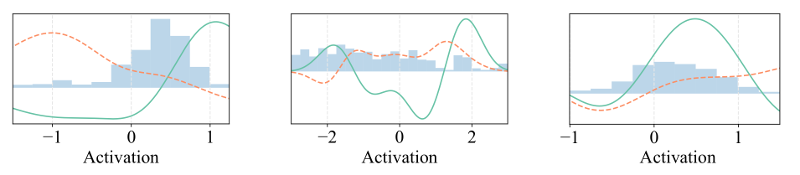
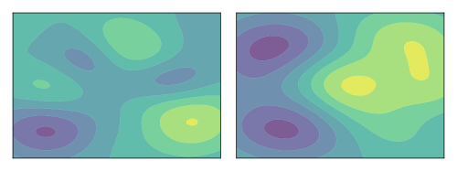

# Kernel Activation Functions

This repository contains several implementations of the kernel activation functions (KAFs) described in the following paper ([link to the preprint](https://arxiv.org/abs/1707.04035)):
	
	Scardapane, S., Van Vaerenbergh, S., Totaro, S. and Uncini, A., 2019. 
	Kafnets: Kernel-based non-parametric activation functions for neural networks. 
	Neural Networks, 110, pp.19-32.
	
## Available implementations

We currently provide the following stable implementations:

* [PyTorch](/pytorch): feedforward and convolutional layers, three kernels (Gaussian/ReLU/Softplus), with random initialization or kernel ridge regression.
* [Keras](/keras): same functionalities as the PyTorch implementation.
* [TensorFlow](/tensorflow/): similar to the Keras implementation, but we use the internal tf.keras.Layer and the eager execution in the demos.
* [Autograd](/autograd): only feedforward layers with a Gaussian kernel and random initialization.

More information for each implementation is given in the corresponding folder. The code should be relatively easy to plug-in in other architectures or projects.

## What is a KAF?

Most neural networks work by interleaving linear projections and simple (fixed) activation functions, like the ReLU function:

A KAF is instead a non-parametric activation function defined as a one-dimensional kernel approximator:

where:

* The dictionary of the kernel elements is fixed by sampling the x-axis with a uniform step around 0.
* The user can select the kernel function (e.g., Gaussian, ReLU, Softplus) and the number of kernel elements D.
* The linear coefficients are adapted independently at every neuron via standard back-propagation.

In addition, the linear coefficients can be initialized using kernel ridge regression to behave similarly to a known function in the beginning of the optimization process.

 
Fig. 1. Examples of kernel activation functions learned on the Sensorless data set. The KAF after initialization is shown with a dashed red, while the final KAF is shown with a solid green. As a reference, the distribution of activation values after training is shown in light blue.

 
Fig. 2. Examples of two-dimensional kernel activation functions learned on the Sensorless data set.

## Contributing

If you have an implementation for a different framework, or an enhanced version of the current code, feel free to contribute to the repository. For any issues related to the code you can use the issue tracker from GitHub.

## Citation

If you use this code or a derivative thereof in your research, we would appreciate a citation to the original paper:

	@article{scardapane2019kafnets,
      title={Kafnets: Kernel-based non-parametric activation functions for neural networks},
      author={Scardapane, Simone and Van Vaerenbergh, Steven and Totaro, Simone and Uncini, Aurelio},
      journal={Neural Networks},
      volume={110},
      pages={19--32},
      year={2019},
      publisher={Elsevier}
    }
	
## License

The code is released under the MIT License. See the attached LICENSE file.
